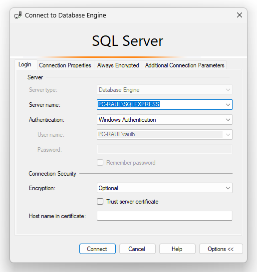

# Description

This inventory system is developed using Windows Forms in the .NET Framework, utilizing C# as the programming language. The application is designed for desktop environments and operates on Windows platforms. The primary functionalities of the inventory system include:

## User Interface

The system features a user-friendly interface created with Windows Forms, allowing easy navigation and management of inventory items.

## Item Management

Users can add, update, delete, and view inventory items. Each item record includes details such as item name, category, quantity, and price.

## Stock Monitoring

The system provides real-time monitoring of stock levels, alerting users when stock levels are low and need replenishment.

## Reporting

Generate detailed reports on inventory status, transactions, and historical data.

## Search and Filtering

Advanced search and filtering options enable users to quickly find specific items or groups of items based on different criteria.

## User Authentication and Roles

Implementing user authentication ensures that only authorized personnel can access the system. Different user roles can be assigned with specific permissions for managing inventory.

## Database integration

The application connects to a backend database to store and retrieve inventory data, ensuring data persistence and integrity.

This robust inventory system helps streamline inventory management processes, reduce manual errors, and enhance overall efficiency in managing stock for businesses.

# Installation

## Setting up the DB

Unfortunately i cannot afford paying for a remote database service, so in order to use this application, the user must create his own local database in Microsoft SQL Server.

I will not describe the full installation process of SQL Server.

1. Create a DB with this settings:

**NOTE:** The server name doesn´t has to be the same i use, SQL server will suggest you automatically, remember this is the name of your server, not the database**

2. Open a new query and paste the content of the file SQL_TABLES.txt in it and execute.

The database is all set, now let´s install de application

## Installing the application

1. Download the latest release.

2. Modify the InventoryManagement.exe.config file and replace "CHANGE_THIS_ONE" field with the connection string of the database you just created.

3. Save the file and execute the .exe file.

4. Login:
   
Admin account:
   
Raúl 
Admin1

User account:

Edwin
Admin2

