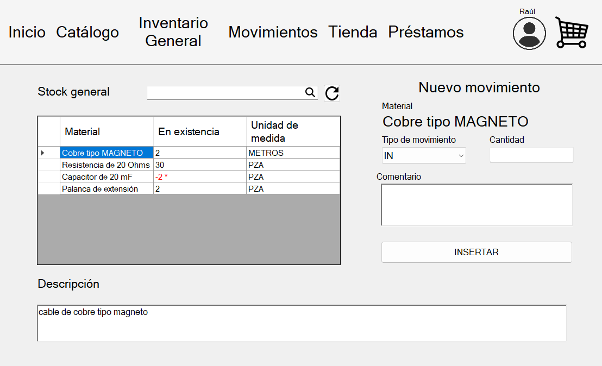

# Description

This inventory system is developed using Windows Forms in the .NET Framework, utilizing C# as the programming language. The application is designed for desktop environments and operates on Windows platforms. The primary functionalities of the inventory system include:

# Primary functionalities

## User Interface

The system features a user-friendly interface created with Windows Forms, allowing easy navigation and management of inventory items.

## Item Management

Users can add, update, delete, and view inventory items. Each item record includes details such as item name, category, measurement unit and type.

## Stock Monitoring

The system provides real-time monitoring of stock levels, alerting users when stock levels are low and need replenishment.

## Movements history

The system includes a Kardex-type movements table that provides a comprehensive record of all inventory transactions. This feature is crucial for generating detailed reports on every movement within the inventory, capturing essential data such as quantities, dates, and associated items.

Having a detailed history of movements can be immensely valuable for several reasons:

1.  **Enhanced Tracking and Accountability**: It allows for precise tracking of inventory changes, making it easier to identify discrepancies and ensure accurate inventory levels.

2.  **Improved Decision-Making**: Historical data provides insights into inventory trends and usage patterns, helping to make informed decisions regarding stock management and replenishment strategies.

3.  **Regulatory Compliance**: For industries with strict regulatory requirements, maintaining a detailed log of inventory movements can help meet compliance standards and provide necessary documentation during audits.

4.  **Operational Efficiency**: By analyzing movement patterns, businesses can optimize their inventory processes, reduce waste, and improve overall efficiency.

## Search and Filtering

Advanced search and filtering options enable users to quickly find specific items or groups of items based on different criteria.

## User Authentication and Roles

Implementing user authentication ensures that only authorized personnel can access the system. Different user roles can be assigned with specific permissions for managing inventory.

## Database integration

The application connects to a backend database to store and retrieve inventory data, ensuring data persistence and integrity.

This robust inventory system helps streamline inventory management processes, reduce manual errors, and enhance overall efficiency in managing stock for businesses.

# Installation

## Setting up the DB

Unfortunately i cannot afford paying for a remote database service, so in order to use this application, the user must create his own local database in Microsoft SQL Server.

I will not describe the full installation process of SQL Server.

1. Create a DB with this settings:

> [!NOTE] 
The server name doesn´t has to be the same i use, SQL server will suggest you automatically, remember this is the name of your server, not the database*

2. Open a new query and paste the content of the file SQL_TABLES.txt in it and execute.

The database is all set, now let´s install de application

## Installing the application

1. Download the latest release.

2. Modify the InventoryManagement.exe.config file and replace "CHANGE_THIS_ONE" field with the server name of the database you just created.

3. Save the file and execute the .exe file.

4. Login:

<table>
        <tr>
            <th>Account type</th>
            <th>Username</th>
            <th>Password</th>
        </tr>
        <tr>
            <td>Admin account</td>
            <td>Raúl</td>
            <td>Admin1</td>
        </tr>
        <tr>
            <td>User account</td>
            <td>Edwin</td>
            <td>Admin2</td>
        </tr>
    </table>
   
